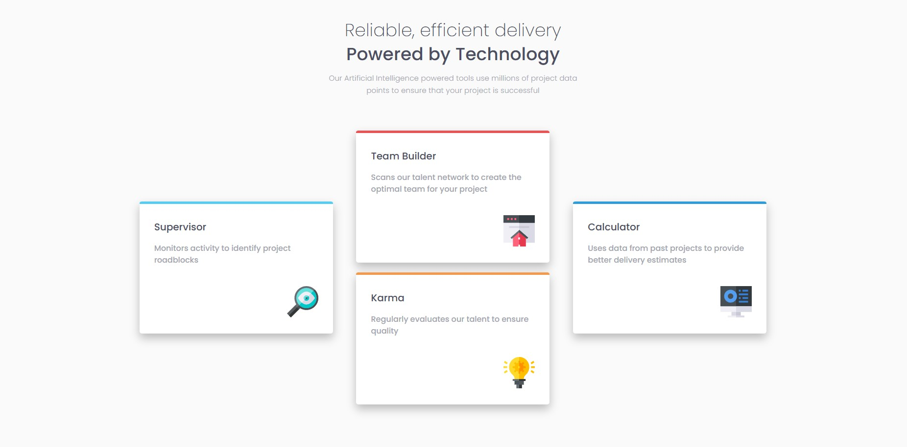
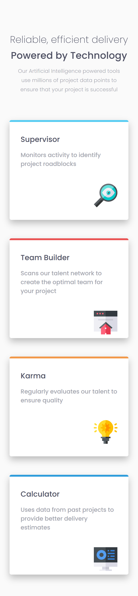

# Frontend Mentor - Four card feature section solution

This is a solution to the [Four card feature section challenge on Frontend Mentor](https://www.frontendmentor.io/challenges/four-card-feature-section-weK1eFYK). 

ES
Esta es la solucion al reto [Four card feature section challenge on Frontend Mentor](https://www.frontendmentor.io/challenges/four-card-feature-section-weK1eFYK).

## Tabla de contenidos
- [Overview/Introduccion](#overview)
  - [Screenshot/Capturas de pantalla](#screenshot)
  - [Links](#links)
- [My process/Mi proceso](#my-process)
- [Author/Autor](#author)

## Overview
  This is the Four card feature section challenge, the objetive of this challenge is to build out this Product preview card component and get it looking as close to the design as possible.
  Es es reto de una seccion con 4 tarjetas para ejercitar el uso de css grid, el objetivo de este reto es construir una Tajeta de producto, tratando de asemejar el diseño tanto como sea posible.
### Screenshot

### Links

- Solution URL: [URL](https://github.com/chefoce/four-card-feature-section-master-main)
- Live Site URL: [URL](https://chefoce.github.io/four-card-feature-section-master-main/)

/*Pendiente*/
## Author

- Website - [Carlos Oceguera](https://www.your-site.com)